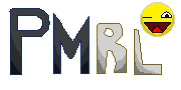

# PMRL: Pac-Man Roguelike

  

An arcade stealth-extraction survival-horror rogue-lite built entirely from scratch with HTML5 Canvas and vanilla JavaScript. Inspired by retro arcade aesthetics and the dual-phase adrenaline loops of *Roblox Nullscape [BLOOM IN DOOM]*.

## 🕹️ The Core Gameplay Loop
1. **Phase 1 (Collection)**: Drop into the central spawning house. Navigate a massive, scrolling pillar maze to locate and collect every standard White Dot while dodging **Baby**, a lethal wall-phasing entity that stalks your position.
2. **Phase 2 (Extraction)**: The instant the final White Dot is consumed, all pathways refill with glittering Gold currency. The central house opens up as a glowing neon Yellow portal. 
3. **The Glitch Screen Collapse**: A progressive Level 256 Kill Screen corruption begins eating map tiles from the edges inward. The longer you stay to risk harvesting optional Gold currency, the more glitched tiles spawn, accelerating Baby's attack delays down to near-instant speeds.
4. **Intermission**: Safely escape through the center portal to access the persistent Upgrade Shop and trade your collected Gold for game-altering perks.

## 🛠️ Developmental Patch Roadmap
- **V1.0.0**: [Current Baseline Alpha] Core movement, procedural pillar map arrays, tracking camera viewport, and basic dual white-to-gold loop transitions.
- **V1.0.0#1**: Independent Global Heartbeat Clocks & Baby Entity Upscale Sizing Pass.
- **V1.0.0#2**: Symmetrical HTML/CSS Sidebar HUD Grid Panels (Left Curses / Right Upgrades).
- **V1.0.0#3**: Persistent Currency Gold Wallet Framework.
- **V1.0.0#4**: Radar Compass Upgrade Mechanics Logic Engine.
- **V1.0.0#5**: Interactive Intermission Shop Screen State Switching.
